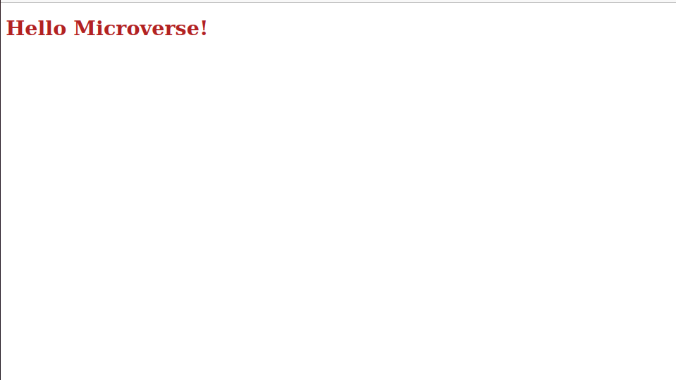

# Hello-Microverse

> This is the first project that is done after becoming a Micronaut.

The goal of this project is to master all of the tools and best practices. We will be using it in all Microverse projects and most likely in our future job as well.

## Built With

- HTML & CSS
- VSCode

## Author

# Sahar Abdel Samad

- GitHub: [@sahar-abdelsamad](https://github.com/Sahar-AbdelSamad)
- Twitter: [@abdelsamadsahar](https://twitter.com/AbdelSamadSahar)
- LinkedIn: [sahar-abdel-samad](https://www.linkedin.com/in/sahar-abdel-samad/)

## Show your support

Give a ⭐️ if you like this project!